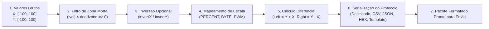

# 🎮 OmniRC Remote - Controle Remoto Universal para Android

Aplicativo Android completo, nativo, compilado e instalável para controle remoto de veículos de rádio controle (RC), robôs móveis, drones, esteiras, braços mecânicos e sistemas embarcados com **ESP32**, **Arduino**, **Raspberry Pi**, **Raspberry Pi Pico W**, **STM32** e **micro:bit**.

O sistema opera com comunicação em tempo real via **Wi-Fi** (UDP, TCP Socket e HTTP) e **Bluetooth** (Classic SPP e Low Energy BLE), dispondo de layouts e protocolos 100% personalizáveis.

---

## 📦 APK Compilado e Instalação Rápida

* **Download Direto:** [OmniRC-Remote.apk (GitHub Releases)](https://github.com/BryamSidoly/OmniRC/releases/download/v1.0.0/OmniRC-Remote.apk)
* **Arquivo no Repositório:** `OmniRC-Remote.apk` (~78 KB)
* **Assinatura:** APK Signature Scheme v1, v2 e v3 (compatível do Android 5.0 Lollipop ao Android 14+)

### Como Instalar no Celular:
1. **Pelo Computador (Wi-Fi Local):** Execute `python serve.py` e abra no navegador do celular o endereço exibido (ex: `http://192.168.x.x:8080/OmniRC-Remote.apk`).
2. **Transferência Direta:** Transfira o arquivo `OmniRC-Remote.apk` via USB, WhatsApp ou Drive e clique em **Instalar** no celular.

---

## 🏗️ Arquitetura Interna do Sistema

O OmniRC utiliza uma arquitetura híbrida de alta performance, unindo uma interface gráfica fluida e responsiva baseada em HTML5/Canvas com controladores nativos em Java em threads dedicadas para garantir baixíssima latência e evitar congelamento de interface (UI blocking):

```mermaid
flowchart TD
    subgraph UI ["Interface do Usuário (WebView / JS Engine)"]
        Touch["Interação do Usuário\n(Touch, Analógicos, Sliders, Botões)"]
        JM["Gerenciador de Layouts\n(layouts.js & joystick.js)"]
        PM["Motor de Protocolos\n(protocol.js)"]
        TxLoop["Loop Temporizado TX\n(txRateMs: 20ms / 50ms / 100ms)"]
        AudioHaptic["Feedback Sensorial\n(Web Audio Synth + Vibração)"]
    end

    subgraph Bridge ["Ponte Nativa Android (Java Bridge)"]
        BridgeInt["@JavascriptInterface\nWebAppInterface.java"]
    end

    subgraph Native ["Controladores Nativos em Threads Dedicadas"]
        NetCtrl["NetworkController.java\n(Wi-Fi UDP / TCP / HTTP)"]
        BtClassic["BluetoothClassicController.java\n(RFCOMM / SPP Serial)"]
        BtBle["BluetoothLeController.java\n(GATT Nordic UART / HM-10)"]
    end

    subgraph Hardware ["Meio Físico & Receptor Remoto"]
        Antenna["Antena de Rádio\n(Wi-Fi / Bluetooth do Telefone)"]
        MCU["Microcontrolador Embarcado\n(ESP32 / Arduino / RPi)"]
        Motors["Atuadores Físicos\n(Ponte H, Servos, ESC, Relés)"]
    end

    Touch --> JM
    JM --> AudioHaptic
    JM --> PM
    PM --> TxLoop
    TxLoop --> BridgeInt

    BridgeInt --> NetCtrl
    BridgeInt --> BtClassic
    BridgeInt --> BtBle

    NetCtrl --> Antenna
    BtClassic --> Antenna
    BtBle --> Antenna

    Antenna --> MCU
    MCU --> Motors

    %% Fluxo de Telemetria Reversa
    MCU -. Telemetria / Respostas .-> Antenna
    Antenna -. Recebimento de Pacotes .-> NetCtrl
    Antenna -. Recebimento Serial .-> BtClassic
    Antenna -. Notificações GATT .-> BtBle
    NetCtrl -. evaluateJavascript .-> BridgeInt
    BtClassic -. evaluateJavascript .-> BridgeInt
    BtBle -. evaluateJavascript .-> BridgeInt
    BridgeInt -. window.onNativeData .-> UI
```

### Telemetria Bidirecional
Além de enviar comandos, o aplicativo escuta respostas e dados de sensores (temperatura, tensão da bateria, eco de status) transmitidos pelo microcontrolador. O fluxo reverso passa pelas threads nativas e é injetado no DOM através do terminal serial em tempo real (`window.onNativeData`).

---

## 📡 Funcionamento Detalhado das Conexões

O aplicativo suporta 5 canais físicos de comunicação, cada um otimizado para um cenário específico de automação ou rádio controle:

### 1. Wi-Fi UDP (User Datagram Protocol) - *Padrão para RC em Tempo Real*
* **Como opera:** utiliza datagramas puros (`java.net.DatagramSocket` e `DatagramPacket`) na camada de transporte IP.
* **Sem Handshake:** não há estabelecimento de conexão prévia de 3 vias (3-way handshake) nem confirmação de entrega (ACK/NACK).
* **Por que é o ideal para RC:** em veículos rápidos, dados defasados não têm utilidade. Se um pacote com a posição do acelerador se perder, o próximo chegará em 20 ms. O UDP elimina o overhead e o buffer bloqueante do TCP, mantendo latência inferior a **3 ms**.
* **Modo Unicast vs Broadcast:**
  - **Unicast:** envia diretamente ao IP do carrinho (ex: `192.168.4.1` em modo Access Point ou `192.168.1.150` em modo estação).
  - **Broadcast (`255.255.255.255`):** transmite para todos os dispositivos da sub-rede na porta configurada (padrão `8888`), permitindo conectar instantaneamente sem precisar descobrir o IP do microcontrolador.
* **Escuta Paralela:** uma thread em background (`udpReceiveThread`) escuta continuamente mensagens de retorno com buffer de 2048 bytes.

### 2. Wi-Fi TCP Socket (Transmission Control Protocol)
* **Como opera:** estabelece conexão de fluxo contínuo e persistente (`java.net.Socket`) com o servidor do microcontrolador.
* **Garantia de Entrega:** todo byte enviado é confirmado pelo receptor. Ideal para braços robóticos, comandos de configuração e envio de comandos onde nenhuma perda pode ocorrer.
* **Delimitação de Pacotes:** pacotes são transmitidos sequencialmente no `OutputStream` com caracteres terminadores de linha (`\n` ou `\r\n`) para que o microcontrolador possa separá-los facilmente via `readStringUntil('\n')`.

### 3. Wi-Fi HTTP (RESTful GET/POST)
* **Como opera:** dispara requisições assíncronas via `java.net.HttpURLConnection` em pool de threads (`Executors.newCachedThreadPool()`).
* **Ideal para:** servidores web embarcados simples em ESP8266/ESP32 (como `ESPAsyncWebServer`), acionando endpoints como `http://192.168.4.1/cmd?action=FRENTE`.

### 4. Bluetooth Classic SPP (Serial Port Profile / RFCOMM)
* **Como opera:** emula uma porta serial RS-232 transparente sobre a camada RFCOMM do Bluetooth.
* **UUID Padrão:** utiliza o UUID universal de porta serial SPP:  
  `00001101-0000-1000-8000-00805F9B34FB`
* **Compatibilidade:** módulos **HC-05**, **HC-06**, **ESP32 Classic** (via `BluetoothSerial.h`), adaptadores Arduino e robôs educacionais.
* **Ciclo de Conexão:**
  1. O aplicativo lê os dispositivos previamente pareados no Android (`BluetoothAdapter.getBondedDevices()`).
  2. Dispara a conexão em thread assíncrona para não travar a interface (`device.createRfcommSocketToServiceRecord(SPP_UUID)`).
  3. Uma thread de leitura contínua (`readThread`) monitora o `InputStream` para exibir dados de sensores no terminal do app.

### 5. Bluetooth Low Energy (BLE - GATT Central)
* **Como opera:** conecta como dispositivo **Central (Cliente)** a servidores GATT embarcados com perfil de porta serial BLE.
* **Serviços Suportados Automaticamente:**
  - **Nordic UART Service (NUS):** padrão da indústria para microcontroladores modernos:
    - Service UUID: `6E400001-B5A3-F393-E0A9-E50E24DCCA9E`
    - TX Characteristic (Envio): `6E400002-B5A3-F393-E0A9-E50E24DCCA9E` (Write)
    - RX Characteristic (Retorno): `6E400003-B5A3-F393-E0A9-E50E24DCCA9E` (Notify)
  - **Módulos HM-10 / CC2541 / AT-09:**
    - Service UUID: `0000FFE0-0000-1000-8000-00805F9B34FB`
    - Characteristic: `0000FFE1-0000-1000-8000-00805F9B34FB`
* **Negociação de MTU:** solicita negociação de MTU de até 512 bytes (`requestMtu(512)`). Em dispositivos que só aceitam MTU padrão de 20 bytes, o app faz fragmentação segura em chunks.
* **Scanner BLE com RSSI:** localiza dispositivos no ar exibindo o nível de potência de sinal recebido em decibéis (dBm), auxiliando a verificar proximidade.

---

## ⚙️ Funcionamento Detalhado dos Protocolos

O motor de protocolos (`ProtocolManager`) é o coração do OmniRC, responsável por traduzir toques na tela em comandos formatados:



### 1. Filtro de Zona Morta (Deadzone)
Evita que folgas no analógico ou movimentos mínimos do dedo façam o veículo se mover sozinho em repouso.
* Se $|\text{valor}| < \text{deadzone}$ (configurável de 0% a 20%), o valor é zerado automaticamente antes do envio.

### 2. Mapeamento de Faixa de Valores (Value Range)
Diferentes microcontroladores trabalham com escalas distintas:
* **PERCENT (-100 a +100):** padrão intuitivo para aceleração e esterçamento.
* **BYTE (0 a 255):** escala positiva de 8 bits muito comum em receptores simples. O ponto neutro (centro) é mapeado exatamente em **128**:
  $$\text{Byte} = \text{round}\left(\frac{\text{val} + 100}{200} \times 255\right)$$
* **PWM (-255 a +255):** mapeamento direto para PWM com sinal (usado para alimentar pontes H como L298N, TB6612FNG):
  $$\text{PWM} = \text{round}\left(\frac{\text{val}}{100} \times 255\right)$$

### 3. Tração Diferencial Automática (Differential Steering)
Para carrinhos de esteira, barcos com 2 hélices ou robôs com 2 motores onde não há servo de esterçamento e as curvas são feitas pela diferença de rotação das rodas:
* O app calcula matematicamente no cliente as velocidades dos motores:
  $$\text{Motor Esquerdo} = \text{clamp}(Y + X, -100, 100)$$
  $$\text{Motor Direito} = \text{clamp}(Y - X, -100, 100)$$
* Os valores de `left` e `right` já saem normalizados na escala escolhida e podem ser incluídos no pacote via tags `{left}` e `{right}`.

### 4. Formatos de Serialização Suportados

| Formato | Sintaxe Gerada | Exemplo de Saída | Uso Recomendado |
| :--- | :--- | :--- | :--- |
| **Delimitado (`DELIMITED`)** | `{cmd}:{x}:{y}:{val}\n` | `DRIVE:15:85\n` | ESP32/Arduino com `sscanf()` ou `strtok()` |
| **CSV** | `{cmd},{x},{y},{val}\n` | `DRIVE,15,85\n` | Padrão clássico de telemetria |
| **Texto Simples (`RAW`)** | `{cmd}\n` | `F\n`, `B\n`, `L\n`, `R\n`, `S\n` | Carrinhos básicos de 1 caractere |
| **JSON** | `{"cmd":"...","x":..,"y":..}\n` | `{"cmd":"DRIVE","x":15,"y":85}\n` | ESP32 com biblioteca `ArduinoJson` |
| **Hexadecimal (`HEX`)** | `AA [CMD] [X] [Y] [VAL] 55` | `AA 44 0F 55 00 55` | Protocolos binários industriais ou rádio RF |
| **Template Customizado** | Interpolação textual livre | `M:{left}:{right}\n` ou `RC:{cmd}:{x}:{y}` | Qualquer formato customizado pelo usuário |

#### Marcadores Suportados no Template Customizado:
* `{cmd}`: Nome do comando (ex: `DRIVE`, `SPEED`, `JOY1`).
* `{x}`: Valor do eixo horizontal mapeado.
* `{y}`: Valor do eixo vertical mapeado.
* `{val}`: Valor escalar (slider ou botão).
* `{left}`: Valor calculado para o motor esquerdo (tração diferencial).
* `{right}`: Valor calculado para o motor direito (tração diferencial).
* `\n` ou `\r\n`: Quebras de linha reais.

### 5. Loop Temporizado de Transmissão (Tx Rate Loop)
Para evitar saturar o buffer serial ou o stack de rede do microcontrolador com centenas de eventos de touch por segundo, o OmniRC utiliza um **loop desacoplado**:
* Taxas configuráveis: **20 ms (50 Hz)**, **50 ms (20 Hz)** ou **100 ms (10 Hz)**.
* Os analógicos apenas atualizam registradores em memória; o timer periódico transmite a foto do estado na frequência exata programada.
* **Benefício de Segurança:** essa cadência contínua é ideal para implementar um temporizador de cão de guarda (**Watchdog**) no microcontrolador.

### 6. Sistema de Parada de Emergência (Fail-Safe & E-Stop)
* **Botão Físico na Barra Superior:** zera imediatamente todos os estados internos do acelerador, volante e esteiras.
* **Disparo Redundante de Corte:** transmite pacotes de parada imediata em múltiplos formatos (`STOP` formatado e `S\n` ASCII).
* **Feedback Visual e Tátil:** pulso de vibração longo de 100 ms, aviso sonoro em onda dente de serra e alerta visual instantâneo na tela.

---

## 🎨 Construtor de Layout Personalizado

No menu de layouts, selecione **🎨 Layout Personalizado**. Você pode montar um painel exclusivo com elementos modulares:

1. **🕹️ Joysticks Analógicos:**
   - Eixos: Ambos (X/Y), Somente Y (Vertical/Acelerador) ou Somente X (Horizontal/Direção).
   - Retorno ao centro com mola ou posição fixa (mantém a posição solta).
   - Telemetria de coordenadas em tempo real (`X:0 Y:0`).
   - Comando associado no protocolo (ex: `JOY1`, `CAMERA_TILT`).

2. **🎚️ Sliders (Controles Deslizantes / Servos / PWM):**
   - Valores mínimo, máximo e valor inicial configuráveis.
   - Envio imediato ao deslizar formatado pelo motor de protocolos.
   - Mostrador numérico em tempo real.

3. **🔘 Botões de Ação Táteis:**
   - Comportamento **Momentâneo** (ativo enquanto segurado) ou **Alternar / Toggle** (liga/desliga iluminado).
   - Comando ao pressionar e comando customizado opcional ao soltar (ex: `TURBO` e `TURBO_OFF`).
   - Cores de destaque: Ciano, Verde, Âmbar, Vermelho e Magenta.
   - Feedback de som sintético Web Audio e vibração nativa.

4. **📐 Espaçadores e Divisores (Paddings):**
   - Criação de divisores estilizados com títulos de seção (ex: "Controles Principais", "Câmera").
   - Alturas de 12px, 24px e 40px.

5. **Organização em Grid Flexível:**
   - **50%:** 2 elementos lado a lado na mesma linha.
   - **100%:** ocupa a largura total da linha.
   - Reordenação (⬆️ subir / ⬇️ descer) e exclusão (🗑️) no menu de gerenciamento.
   - Persistência automática no armazenamento do Android.

---

## 🕹️ Layouts Pré-configurados Especializados

* **🏎️ Carro RC / Rover:** acelerador vertical, direção horizontal, limitador de potência (10% a 100%) e botões de ação rápida (Farol, Buzina, Turbo, Marchas).
* **🛡️ Tanque / Esteiras:** analógicos verticais independentes para esteira esquerda e direita com botões para giro de 360° no próprio eixo.
* **🎮 Gamepad Console:** dois analógicos de 360° e botões estilo console (A, B, X, Y, L1, R1).
* **🦾 Braço Robótico / Servos:** 4 sliders analógicos para juntas articuladas (Base S1, Ombro S2, Cotovelo S3, Garra S4) e botões de poses pré-salvas (Home, Pick, Drop).
* **📟 Terminal Serial & Monitor:** terminal de telemetria bidirecional, envio manual e histórico de mensagens.

---

## 🧪 Ambiente de Testes e Simulação no Windows

* **Simulador Completo com Dashboard Web (`rc_device_server.py`):**
  ```powershell
  python rc_device_server.py
  ```
  Abre um painel em `http://localhost:5500` com velocímetro, volante com ângulo real, motores, luzes, buzina, telemetria e 4 servos animados. Escuta em UDP e TCP na porta 8888.
* **Simulador no Navegador (`simulate.py`):** roda a interface do app no navegador do PC com mock da API Android nativa.
* **Receptor UDP Simples (`mock_receiver.py`):** exibe pacotes UDP diretamente no console do Windows.
* **Depuração Remota via Chrome DevTools:** conecte o celular por USB com depuração ativada e acesse `chrome://inspect/#devices`.

---

## 💻 Exemplos de Código para Receptores Embarcados

### 1. ESP32 com Wi-Fi UDP e Watchdog de Segurança (Fail-Safe)
```cpp
#include <WiFi.h>
#include <WiFiUdp.h>

const char* ssid = "NOME_DO_SEU_WIFI";
const char* password = "SENHA_DO_SEU_WIFI";
WiFiUDP udp;
char packetBuffer[255];

// Temporizador de segurança (Fail-Safe)
unsigned long lastPacketTime = 0;
const unsigned long TIMEOUT_MS = 600; // Desliga motores se ficar 600ms sem sinal

void stopMotors() {
  // Coloque aqui os comandos para zerar o PWM da ponte H
  // analogWrite(PIN_MOTOR_A, 0);
  // analogWrite(PIN_MOTOR_B, 0);
}

void setup() {
  Serial.begin(115200);
  WiFi.begin(ssid, password);
  while (WiFi.status() != WL_CONNECTED) {
    delay(300);
    Serial.print(".");
  }
  Serial.print("\nConectado! IP do Carrinho: ");
  Serial.println(WiFi.localIP()); // Coloque este IP na aba Conexão do OmniRC
  udp.begin(8888); // Porta padrão do OmniRC
}

void loop() {
  int packetSize = udp.parsePacket();
  if (packetSize) {
    int len = udp.read(packetBuffer, 255);
    if (len > 0) packetBuffer[len] = '\0';
    lastPacketTime = millis(); // Atualiza watchdog

    char cmd[16];
    int x = 0, y = 0;
    // Processa o formato padrão: DRIVE:X:Y
    if (sscanf(packetBuffer, "%[^:]:%d:%d", cmd, &x, &y) >= 1) {
      if (strcmp(cmd, "DRIVE") == 0) {
        // x = direção (-100 a +100), y = acelerador (-100 a +100)
        Serial.printf("Drive -> Volante: %d%% | Acelerador: %d%%\n", x, y);
      } else if (strcmp(cmd, "STOP") == 0) {
        stopMotors();
      }
    }
  }

  // Se o sinal Wi-Fi cair ou o app for fechado, o watchdog desliga os motores
  if (millis() - lastPacketTime > TIMEOUT_MS) {
    stopMotors();
  }
}
```

### 2. ESP32 com Bluetooth Classic SPP
```cpp
#include "BluetoothSerial.h"

BluetoothSerial SerialBT;

void setup() {
  Serial.begin(115200);
  SerialBT.begin("OmniRC_Car"); // Nome exibido na busca Bluetooth do celular
  Serial.println("Bluetooth Classic pronto para pareamento!");
}

void loop() {
  if (SerialBT.available()) {
    String comando = SerialBT.readStringUntil('\n');
    Serial.println("Comando Bluetooth recebido: " + comando);
    // Processar o comando recebido
  }
}
```

---

## 🛠️ Como Recompilar o APK

Para recompilar o projeto após qualquer alteração:
```powershell
python build.py
```
O script executa automaticamente AAPT2, vinculação com o `android.jar`, compilação Java com javac, conversão Dalvik DEX com D8 e assinatura v1/v2/v3 em menos de 1 segundo.
